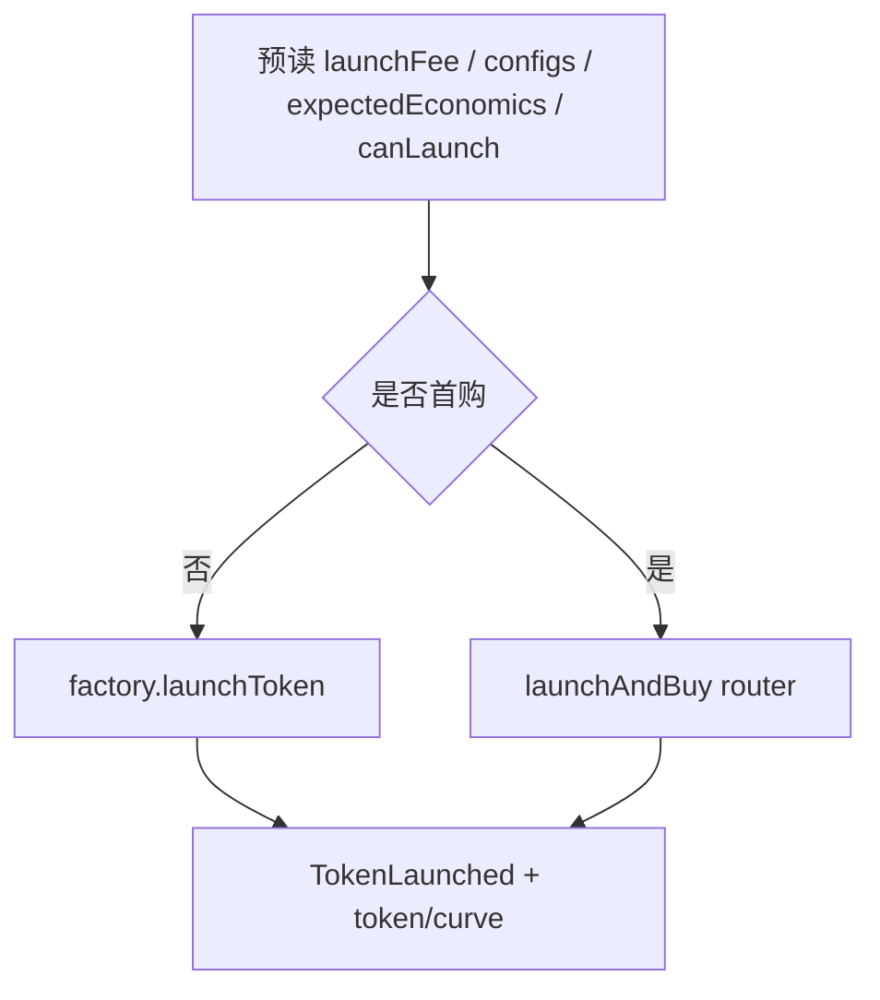

# Launching a token：合约入参与对接计划

依据：[docs Launching a token](https://docs.ponsfamily.com/v2#launching) 与 [`PonsV2LaunchFactory.sol`](contractsV2/src/v2/PonsV2LaunchFactory.sol) 中 `TokenParams` / `launchToken` / `launchTokenFor`。

## 调用路径（二选一）

- **仅创建**：`factory.launchToken(...)`，`msg.value = launchFee`
- **创建 + 首购（推荐对接当前 UI）**：`launchAndBuy.launchAndBuy(...)`  
  - ETH 对：`msg.value = launchFee + quoteIn`  
  - ERC-20 对：`msg.value = launchFee`，且事先 `approve(router, quoteIn)`  
  - `creatorFeeRecipient` **不能为 0**（与纯 launch 不同）

当前 demo UI 有 Developer buy，计划按 **`launchAndBuy`** 实现主路径；无首购时退回 `launchToken`。

---

## 一、写合约入参总表

### A. `TokenParams`（三种入口共用）

| 字段 | 类型 | 含义 |
|---|---|---|
| `name` | `string` | Token 名称；非空 |
| `symbol` | `string` | Ticker；非空 |
| `logo` | `string` | Logo URI（常为 `ipfs://…`） |
| `description` | `string` | 描述 |
| `socials.twitter` | `string` | X / Twitter |
| `socials.telegram` | `string` | Telegram |
| `socials.discord` | `string` | Discord |
| `socials.website` | `string` | Website |
| `socials.farcaster` | `string` | Farcaster |
| `creatorFeeRecipient` | `address` | 手续费收款地址。纯 `launchToken` 时 `0` = 调用者；**`launchAndBuy` 必须显式非 0** |
| `creatorTaxBps` | `uint16` | 额外 creator tax（bps），叠加在 curve 基础费上，全部给 creator；`> maxCreatorTaxBps()` 回滚 |
| `buybackEnabled` | `bool` | 是否开启 buyback+锁仓（从 creator 份额扣） |
| `expectedEconomics` | `bytes32` | 经济条款钉扎。`0` 跳过校验；否则须等于 `previewLaunchEconomics(launchConfigId, pairToken)`，防 owner 改条款夹击 |
| `salt` | `bytes32` | CREATE2 salt；决定可预测的 token/curve 地址；按发起账户命名空间，同人勿复用相同条款+salt |

### B. `launchToken`（Factory）额外参数

| 参数 | 类型 | 含义 |
|---|---|---|
| `launchConfigId` | `uint256` | 选用的 LaunchConfig 索引（供应量、curve 费、phantom、毕业阈值、poolFee、tickSpacing 等） |
| `pairToken` | `address` | 计价资产；`address(0)` = 原生 ETH；非 0 须已 `approvedPairTokens` |
| `snipeTaxExemptions` | `address[]`（可选 overload） | 开盘 sniper tax 额外豁免地址；最多 32；launcher 与 `creatorFeeRecipient` 已自动豁免 |
| `msg.value` / `launchFee` | `uint256` | 必须 **精确等于** `factory.launchFee()`，否则 `LaunchFeeNotPaid` |

返回：`(address token, address curve)`。

### C. `launchAndBuy`（Router）额外参数

| 参数 | 类型 | 含义 |
|---|---|---|
| `params` | `TokenParams` | 同上；`creatorFeeRecipient` 必填 |
| `launchConfigId` | `uint256` | 同上 |
| `pairToken` | `address` | 同上 |
| `quoteIn` | `uint256` | 首购投入的报价资产数量（wei / token decimals） |
| `minTokensOut` | `uint256` | 最少到手 token（滑点保护；curve clamp 后仍校验） |
| `recipient` | `address` | 首购 token 接收地址；**自动**加入 sniper tax 豁免 |
| `snipeTaxExemptions` | `address[]` | 额外豁免；可 `[]` |
| `msg.value` | `uint256` | ETH 对：`launchFee + quoteIn`；ERC-20 对：仅 `launchFee` |

返回：`(address token, address curve, uint256 tokensOut)`。

### D. 非「函数参数」但写交易前必须读的值

| 读接口 | 用途 |
|---|---|
| `launchFee()` | 组装 `msg.value` |
| `launchConfigCount()` / `getLaunchConfig(id)` | 选启用中的 config；拿 graduation / fee 展示 |
| `previewLaunchEconomics(id, pairToken)` | 填 `expectedEconomics` |
| `canLaunch(account)` | 白名单 / 公开放行门 |
| `maxCreatorTaxBps()` | 校验表单 tax |
| `predictLaunchAddresses`（Deployer） | 可选 vanity / 预知地址 |

### E. LaunchConfig（由 id 间接锁定，调用者不可逐项改）

| 字段 | 含义 |
|---|---|
| `supply` | 总供应（铸造到 curve） |
| `curveFeeBps` | 曲线基础交易费 |
| `phantomQuote` | 虚报价储备（ETH 对用 wei；ERC-20 对改用该资产的 PairTokenEconomics） |
| `graduationThreshold` | 毕业所需真实报价量 |
| `poolFee` / `tickSpacing` | 毕业后 Uniswap v4 池参数 |
| `enabled` | 禁用则 `LaunchConfigDisabled` |

---

## 二、与当前 UI 字段映射

[`interface/src/App.tsx`](interface/src/App.tsx) → 合约：

- Name / Ticker / Description / Image → `name` / `symbol` / `description` / `logo`
- X / Telegram → `socials.twitter` / `socials.telegram`（discord/website/farcaster 默认 `""`）
- Paired asset ETH → `pairToken = 0x0`
- Developer buy → `quoteIn`（走 `launchAndBuy`）；空/`0` 则 `launchToken`
- Advanced（待做）：`creatorTaxBps`、`buybackEnabled`、`creatorFeeRecipient`、`salt`、`snipeTaxExemptions`、`launchConfigId`
- 顶栏 Login → `msg.sender` / Privy wagmi 写交易

固定/自动：`expectedEconomics`（预读）、`salt`（随机 32 bytes）、`launchFee`（value）、`minTokensOut`（由 quote hook 推算）、`recipient`/`creatorFeeRecipient` 默认连接钱包。

---

## 三、实现计划（interface 写合约对接）

1. **ABI / 常量**：在 [`interface/src/constants/abis.ts`](interface/src/constants/abis.ts) 补全 `Socials`、`TokenParams`、`launchToken`（含 exemptions overload）、`launchAndBuy`、`launchFee`、`previewLaunchEconomics`、`canLaunch`、`maxCreatorTaxBps`、`getLaunchConfig`；确认 [`PONS_V2_ADDRESSES.launchAndBuy`](interface/src/constants/contracts.ts)。
2. **Hooks**：`useLaunchPrep`（fee/config/economics/canLaunch）；`useLaunchQuote`（developer buy → `minTokensOut`）；`useLaunchToken`（按是否有 `quoteIn` 调 factory 或 router，处理 ETH value / ERC-20 approve）。
3. **表单提交**：校验非空 name/symbol；`canLaunch`；组装 `TokenParams`；submit 调 hook；监听 `TokenLaunched` 或回执解析 `token`/`curve`。
4. **错误映射**：至少处理 `LaunchFeeNotPaid`、`NotWhitelisted`、`LaunchEconomicsMismatch`、`CreatorTaxTooHigh`、`PairTokenNotApproved`、`ExemptionListTooLong`、`InvalidTokenParams`。
5. **去掉调试** `console.log`（`useMemeLaunchCards`）；launch 成功后可把新 token 追加展示或刷新。

不在本次范围：毕业、买卖曲线、claim fees、合约 Solidity 改动（对接现有已部署 factory/router）。

## Demo 降级说明（quote / ERC-20）

当前 `interface` 为 **ETH pair demo**：
- 未实现 `useLaunchQuote` 曲线预估；`minTokensOut` 默认 `0`（无自动滑点保护），可在 Advanced 手动填写。
- 未实现 ERC-20 `pairToken` 的 `approve` 路径；计价资产固定 `address(0)`。
- 生产接入 `launchAndBuy` 前应补齐 quote + slippage，并支持自定义 pair + approve。
